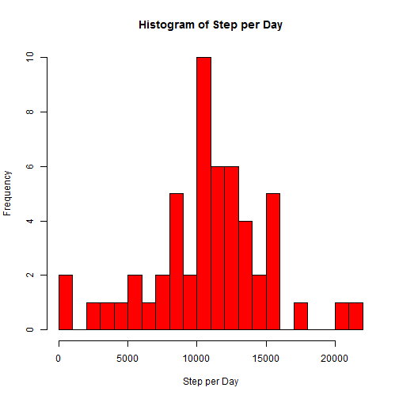
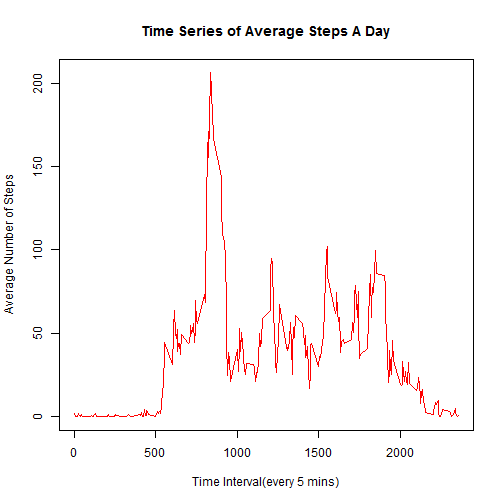
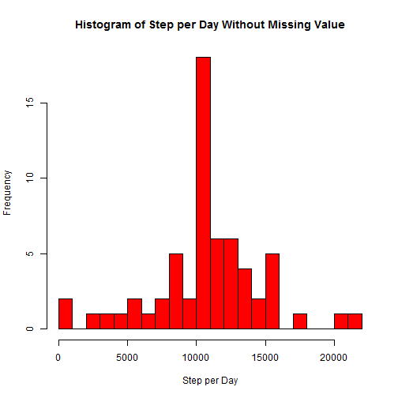
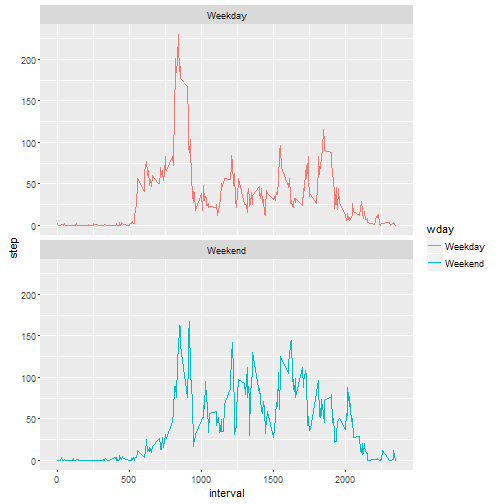

#This is the assignment of Reproducible Research Week2

To start the assignment, library dplyr package first.


```r
library(dplyr)
library(ggplot2)
Sys.setlocale("LC_TIME", "English")
```

```
## [1] "English_United States.1252"
```


1:Code for reading in the dataset and/or processing the data. 
  

```r
setwd("C:/Users/Eric/Documents/R/Homework/Reproducible_week2")
download.file("https://d396qusza40orc.cloudfront.net/repdata%2Fdata%2Factivity.zip",destfile = "data.zip")
unzip(zipfile = "data.zip")
temp.data <-read.csv(file = "activity.csv",header = TRUE,stringsAsFactors = FALSE)
```

2.Histogram of the total number of steps taken each day


```r
step.perday <- select(temp.data,c(steps,date)) %>% filter(steps!="NA") %>% group_by(date) %>% summarise(sum(steps))

hist(step.perday$`sum(steps)`,breaks = 30,col = "red", main = "Histogram of Step per Day",xlab = "Step per Day")
```



3.Mean and median number of steps taken each day


```r
m.perday <- select(temp.data,c(steps,date)) %>% filter(steps!="NA") %>% group_by(date) %>% summarise(mean(steps),median(steps))

names(m.perday)<- c("DATE","Mean step per day","Median step perday")

print(m.perday,n=53)
```

```
## Source: local data frame [53 x 3]
## 
##          DATE Mean step per day Median step perday
##         <chr>             <dbl>              <dbl>
## 1  2012-10-02         0.4375000                  0
## 2  2012-10-03        39.4166667                  0
## 3  2012-10-04        42.0694444                  0
## 4  2012-10-05        46.1597222                  0
## 5  2012-10-06        53.5416667                  0
## 6  2012-10-07        38.2465278                  0
## 7  2012-10-09        44.4826389                  0
## 8  2012-10-10        34.3750000                  0
## 9  2012-10-11        35.7777778                  0
## 10 2012-10-12        60.3541667                  0
## 11 2012-10-13        43.1458333                  0
## 12 2012-10-14        52.4236111                  0
## 13 2012-10-15        35.2048611                  0
## 14 2012-10-16        52.3750000                  0
## 15 2012-10-17        46.7083333                  0
## 16 2012-10-18        34.9166667                  0
## 17 2012-10-19        41.0729167                  0
## 18 2012-10-20        36.0937500                  0
## 19 2012-10-21        30.6284722                  0
## 20 2012-10-22        46.7361111                  0
## 21 2012-10-23        30.9652778                  0
## 22 2012-10-24        29.0104167                  0
## 23 2012-10-25         8.6527778                  0
## 24 2012-10-26        23.5347222                  0
## 25 2012-10-27        35.1354167                  0
## 26 2012-10-28        39.7847222                  0
## 27 2012-10-29        17.4236111                  0
## 28 2012-10-30        34.0937500                  0
## 29 2012-10-31        53.5208333                  0
## 30 2012-11-02        36.8055556                  0
## 31 2012-11-03        36.7048611                  0
## 32 2012-11-05        36.2465278                  0
## 33 2012-11-06        28.9375000                  0
## 34 2012-11-07        44.7326389                  0
## 35 2012-11-08        11.1770833                  0
## 36 2012-11-11        43.7777778                  0
## 37 2012-11-12        37.3784722                  0
## 38 2012-11-13        25.4722222                  0
## 39 2012-11-15         0.1423611                  0
## 40 2012-11-16        18.8923611                  0
## 41 2012-11-17        49.7881944                  0
## 42 2012-11-18        52.4652778                  0
## 43 2012-11-19        30.6979167                  0
## 44 2012-11-20        15.5277778                  0
## 45 2012-11-21        44.3993056                  0
## 46 2012-11-22        70.9270833                  0
## 47 2012-11-23        73.5902778                  0
## 48 2012-11-24        50.2708333                  0
## 49 2012-11-25        41.0902778                  0
## 50 2012-11-26        38.7569444                  0
## 51 2012-11-27        47.3819444                  0
## 52 2012-11-28        35.3576389                  0
## 53 2012-11-29        24.4687500                  0
```

4.Time series plot of the average number of steps taken in each time interval

```r
time.data <- select(temp.data,c(steps,interval)) %>% filter(steps != "NA") %>% group_by(interval) %>% summarise(mean(steps))

plot(time.data$interval,time.data$`mean(steps)`,type="l",xlab = "Time Interval(every 5 mins)",ylab = "Average Number of Steps",main = "Time Series of Average Steps A Day",col="red")
```



5.The 5-minute interval that, on average, contains the maximum number of steps


```r
max.step.interval <-as.integer(subset(time.data,time.data$`mean(steps)`==max(time.data$`mean(steps)`))[,1])
```

The interval 835 contains the maximum number of steps

6.Code to describe and show a strategy for imputing missing data


```r
n.na <- nrow(temp.data[is.na(temp.data$steps),])
```
There are total 2304 NAs in the raw data

To imputting missing value, a average steps of each interval is used. As I believe a person's behavior is almost the same for every day.


```r
c.data <-temp.data
index <-which(is.na(c.data$steps))
c.data[index,1]<-time.data[match(c.data[index,3],time.data$interval),2] #to impute the missing value
```

7.Histogram of the total number of steps taken each day after missing values are imputed


```r
hc.data<-select(c.data,c(steps,date)) %>% group_by(date) %>% summarise(sum(steps))
hist(hc.data$`sum(steps)`,breaks = 30,col = "red", main = "Histogram of Step per Day Without Missing Value",xlab = "Step per Day")
```



Calculating the mean abd median of steps per day with missing value imputted


```r
mhc.data<-select(c.data,c(steps,date)) %>% group_by(date) %>% summarise(mean(steps),median(steps))
names(mhc.data)<- c("DATE","Mean step per day","Median step perday")
print(mhc.data,n=nrow(mhc.data))
```

```
## Source: local data frame [61 x 3]
## 
##          DATE Mean step per day Median step perday
##         <chr>             <dbl>              <dbl>
## 1  2012-10-01        37.3825996           34.11321
## 2  2012-10-02         0.4375000            0.00000
## 3  2012-10-03        39.4166667            0.00000
## 4  2012-10-04        42.0694444            0.00000
## 5  2012-10-05        46.1597222            0.00000
## 6  2012-10-06        53.5416667            0.00000
## 7  2012-10-07        38.2465278            0.00000
## 8  2012-10-08        37.3825996           34.11321
## 9  2012-10-09        44.4826389            0.00000
## 10 2012-10-10        34.3750000            0.00000
## 11 2012-10-11        35.7777778            0.00000
## 12 2012-10-12        60.3541667            0.00000
## 13 2012-10-13        43.1458333            0.00000
## 14 2012-10-14        52.4236111            0.00000
## 15 2012-10-15        35.2048611            0.00000
## 16 2012-10-16        52.3750000            0.00000
## 17 2012-10-17        46.7083333            0.00000
## 18 2012-10-18        34.9166667            0.00000
## 19 2012-10-19        41.0729167            0.00000
## 20 2012-10-20        36.0937500            0.00000
## 21 2012-10-21        30.6284722            0.00000
## 22 2012-10-22        46.7361111            0.00000
## 23 2012-10-23        30.9652778            0.00000
## 24 2012-10-24        29.0104167            0.00000
## 25 2012-10-25         8.6527778            0.00000
## 26 2012-10-26        23.5347222            0.00000
## 27 2012-10-27        35.1354167            0.00000
## 28 2012-10-28        39.7847222            0.00000
## 29 2012-10-29        17.4236111            0.00000
## 30 2012-10-30        34.0937500            0.00000
## 31 2012-10-31        53.5208333            0.00000
## 32 2012-11-01        37.3825996           34.11321
## 33 2012-11-02        36.8055556            0.00000
## 34 2012-11-03        36.7048611            0.00000
## 35 2012-11-04        37.3825996           34.11321
## 36 2012-11-05        36.2465278            0.00000
## 37 2012-11-06        28.9375000            0.00000
## 38 2012-11-07        44.7326389            0.00000
## 39 2012-11-08        11.1770833            0.00000
## 40 2012-11-09        37.3825996           34.11321
## 41 2012-11-10        37.3825996           34.11321
## 42 2012-11-11        43.7777778            0.00000
## 43 2012-11-12        37.3784722            0.00000
## 44 2012-11-13        25.4722222            0.00000
## 45 2012-11-14        37.3825996           34.11321
## 46 2012-11-15         0.1423611            0.00000
## 47 2012-11-16        18.8923611            0.00000
## 48 2012-11-17        49.7881944            0.00000
## 49 2012-11-18        52.4652778            0.00000
## 50 2012-11-19        30.6979167            0.00000
## 51 2012-11-20        15.5277778            0.00000
## 52 2012-11-21        44.3993056            0.00000
## 53 2012-11-22        70.9270833            0.00000
## 54 2012-11-23        73.5902778            0.00000
## 55 2012-11-24        50.2708333            0.00000
## 56 2012-11-25        41.0902778            0.00000
## 57 2012-11-26        38.7569444            0.00000
## 58 2012-11-27        47.3819444            0.00000
## 59 2012-11-28        35.3576389            0.00000
## 60 2012-11-29        24.4687500            0.00000
## 61 2012-11-30        37.3825996           34.11321
```

8.Panel plot comparing the average number of steps taken per 5-minute interval across weekdays and weekends


```r
weekc.data<-c.data
weekc.data$w1<-weekdays(as.Date(weekc.data$date))

weekc.data$wday<-factor(weekc.data$w1 %in% c("Monday","Tuesday","Wednesday","Thursday","Friday"),levels = c(TRUE,FALSE),labels = c("Weekday","Weekend"))

df8<-select(weekc.data,c(steps,interval,wday)) %>% group_by(interval,wday) %>% summarise(mean(steps))

names(df8) <-c("interval","wday","step")
g <-ggplot(data=df8,aes(interval,step,color=wday))
g+geom_line()+facet_wrap(~wday,ncol=1)
```



